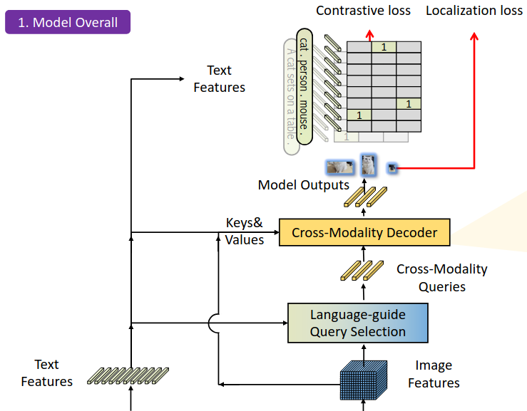
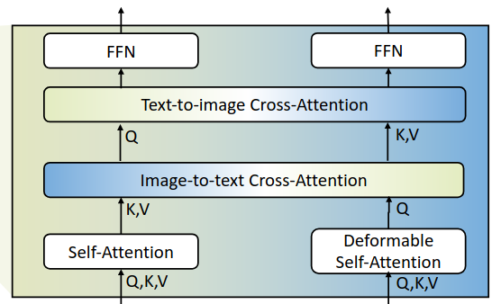
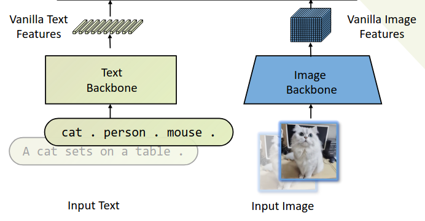
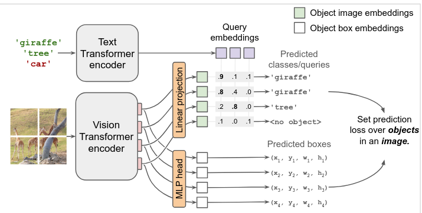

# Abstract

Code is available at https://github.com/jkpjkpjkp/bob and https://github.com/jkpjkpjkp/e

# 引言

Former research highlights the inaccuracies in visual-grounding (vision-perception) in large multimodal models (LMMs) [BLINK, Eyes-wide-shut, Cambrian]. While LMMs are the SOTA way of visual question answering (VQA), due to this visual perception bottleneck, even today's SOTA LMMs cannot accurately count past a dozen objects. In this paper we use Large Language Model (LLM) and Large Multimodal Model (LMM) interchangably, since most frontier LLMs now supports vision. 

LMM's pretraining in internet-scale image-text pairs gives it strong language and visual understanding, yet limits its visual perception to that of the caption. 

Our first motivation is to emulate a human VQA process, where human may continually focus on related areas, taking longer gaze at related areas for more accurate perception, we hypothesize that a inference-time LMM workflow can have a similar effect and lead to better visual perceptive performance. 

Another line of work sparkling in [FunSearch] and propspered recently into [ADAS, AFlow] seeks to optimize llm workflows automatically, offering a second motivation to our work. 

Our work first tries to improve LMM's visual perception using a hand-crafted agentic system, and secondly use LMM to automatically optimize LMM workflows that answer vqa questions. Experiments on the challenging Zerobench-subtasks dataset showed improved results. 

# 文献综述

## Grounding

Grounding dino uses early fusion of image and text features, before decoding into bounding boxes. This can contaminate image features and lead to hallucinations of nonexistent objects appearing in text but not in image. 

Owl v2 have no inference-time text-image fusion, so it will not hallucinate nonexistent objects as grounding dino will, but also lacks the focus of grounding dino on objects of interest; it also do not use additional layers to adjust bounding box coordinates, leading to less accurate bounding boxes. 

We use the 2 models out-of-the box but fuse their results (see appendix), to combine their strenghths into an accurate, hallucination-free object detector. 

## Vision Foundation Models
Vision-only models (SAM, Depth-anything; image-to-3d, 3d-pointcloud methods; computational photography), vision-focused models such as detection (GroundingDINO, OwlV2, Florence-2) and language-focused models (LMMs). To bridge this vision-language (say-what-you-see) gap, works such as semantic segmentation (Seg-Zero 2503.06520) and counting (CountGD) succeeds on specific vision-centric tasks. 
Early efforts of fusing these models include Set-of-Mask prompting, eliciting abilities in SAM to help VLM. 

## Building on Vision Foundation Models
[CountGD] cleverly use light-weigt training to strengthen grounding dino's detection by fusing  reference-images into its input, along with text. the reference image is usually crops from the original image, examplifying an object of interest. Interestingly this posttraining also improves pure-text detection. However, due to its reliance on vision-centric model (grounding_dino), it cannot process rich semantics in text (e.g. How many pandas is standing on wood logs?), for which we need to rely on LMM. 

## Improving LMM's visual perception
[V*: Guided Visual Search] use reference objects (choose reference based on common-sense, e.g. cups are usually near a table) to guide a detection model to zoom in to find object of interest. 

[Eyes-wide-shut] 
[some paper stating the hallucination comes from focusing on text token]

## Visual Thinking
[VisuoThink] writes matplotlib code to visualize geometric problems, improving geometrical maths problem solving and visual navigation. [Visual Sketchpad] uses a similar toolbox to triumph in its maths capabilities; it also allows lmm for simple usage of other visual tools, such as depth, grounding, and suffice for tasks that require a direct usage of such tools (e.g. 'which point is closer, A or B?'). [See, search, and tell] 

## Aflow

Recently, a stream of work ([ADAS], [AFlow], [Flow 2501.07834v2]) seeks to optimize llm workflows automatically. This leads us to presume a similar llm-driven tree search optimization can lead to a synergetic VQA workflow combining strengths of the aforementioned 3 families of v-l models. 

We would like to point out that, despite its claim, [Aflow] do not use Monte-Carlo Tree Search, but a variant of best-first search (beam search). 

## Tree search and effective workflow in pure-text setting

# 手工设计的方法

## 启发
通过使用没有视觉的LLM，forcing it to split visual perception into multiple smaller steps, to bypass the limitation of visual hallucination. 

a key insight into agent building [https://www.anthropic.com/engineering/building-effective-agents] is that interfacing for LLM is the same as interfacing for a human. that is, agent design is frontend design. In our case this is more than true. When LLM decides it likes to write code in a certain format or likes a certain interface, we refactor other parts of codebase to suit it. The goal is to make the interface to LLM clean, crisp, and respecting all LLM's priors. 

It is beneficial to think of prompting as Frontend Design. [https://www.youtube.com/watch?v=oFfVt3S51T4] [https://arvid.xyz/posts/prompt-design/]

## 算法
我们使用没有视觉的LLM（deepseek v3），通过调用工具回答vqa问题。工具池包括VLM（glm-4v-plus）、Grounding(Grounding_Dino和Owl_v2)、SAM2(Segment Anything)、Depth Anything v2。仅依靠较弱的VLM和Grounding，LLM可以在MuirBench的Counting子任务超过领先的VLM，包括GPT-4o。

When using a LMM (qwen-vl-max-latest on May 11 2025), on every 7th task the improvements

## 实验

### Dataset:
MuirBench focuses on robust multi-image understanding capabilities of multimodal LLMs. Its `Counting` subtask requires semantic counting beyond the capabilities of grounding models 

### Baseline:
GPT-4o: 49.15%
GLM-4v-plus (the vlm we use in our pipeline): TODO: 10 tasks 0%, need to look into

# 自动生成的方法

## Method

in each round, we run the 3 strongest graph, run each 5 tasks from select_task (see below) (3x5 runs), then pick the strongest overall graph to optimize. this is different from Aflow (see related works)(TODO: Ablation needed)

in accordance to Aflow, we keep a record of what modifications have already been explored for the current graph, so as to avoid duplicated efforts treading down the same path of optimization. 

### budget control

Since LLM-generated code vary in effectiveness, running every graph on every validation task leads to redundant experimentation, e.g. a graph that cannot pass any test due to formatting bugs will still incur substantial token cost. 

To mitigate this, we design a scheme to get more accurate evaluation on stronger graphs, and early-stop evaluations of weaker graphs. specifically, when each graph is generated, it is ran on 5 tasks; when optimization round starts, we pikc to top-3 strongest graph, and run 5 high-variance tasks (see below) on each, resulting in a randomized stochastic of the graph's performance. 

We note that this method is self-stabilizing. An optimistically evaluated weak graph will show its weakness after testing in more optimization rounds, and harder tasks will become high-variances as the strongest graphs get stronger. The only down side is to accidentally neglect a strong graph that is initially evaluated poorly.  

## Design Details

### select high-variance tasks
randomly pick high-variance tasks (task whose score average among graphs is close to 0.5). this is self-stabilizing to prioritize indicative tasks, as when the graphs become stronger, harder tasks become closer to have a 50% chance of being solved. 

## 实验

### Implementation details:
We use different model for workflow execution and optimization. 

### Limitations in LLM Tool use. 

## 消融

### Evaluations of Design Decisions in [Funsearch], [ADAS], and [Aflow]

# 结论
1. we discovered an agent that uses vision tools for perception, beating previous sota on the counting subtask of muirbench. 
2. 我们确定了AFlow用于LMM可以生成优于baseline的方法。

## Limitations and Future Work
How llm can use tools creatively out-of-distribution remains open. our workflows, both hand-designed and auto-optimized, as well as all prior work, only showcase llm using tools in predefined/prompted/demo-ed ways, using them straightforwardly. 

What is the optimal way of LLM workflow self-optimization remains open. [Funsearch], [ADAS], [Aflow] and our method are still largely empirical, lacking detailed ablation due to budget and time constraints. 

# Appendix

## Implementation details

All LMMs are called with temperature=0. 

implementing and optimizing such a image-related LMM workflow poses more challenge than it seems. 

most notably, JSON serialization do not have built-in support for PIL.Image.Image, inflicting manual work when utilizing many libraries (such as `settrace`, `pydantic`, `sqlalchemy`) that depends on the latter. we ended up using a global hashing of images and pass strings containing such clearly marked hash (between <_imimgimage> and </_imimgimage>) around, until images are explitly needed. 

a note on using `sqlalchemy` and `sqlmodel`: prepend `session.expire_on_commit = False` to every session unless db is really huge and performance is a major concern. 

This raise a second challenge of communicating such custom designs to LMM optimizer, as they are trained on standard code. Much design went into hiding image serialization under the carpet. 

Also, many convenient llm agent libraries such as metagpt, langchain, dspy etc. either have minimal support for images, or such support is initial and poorly documented. We ended up building from raw api calls. we experimented with many ways to let LMM predictably write code formatted in the way we wish. What worked finally is using xml tags, and fully standalone code with full import of custom functions (that is, mentioning custom functions in prompt works less well as showing them as import in code. )

### Experiment Details

for Muir bench counting, we use LLM-as-a-judge with Deepseek V3. 

## Synergizing Grounding_Dino (G_Dino) and Owl_v2

the 2 strongest open weights open vocabulary grounding models have an interestingly distinctive design on when to merge the modalities. 

G_Dino merges vision and language very early, enabling vision encoder to focus on objects of interest, leading to superior bounding box IoU. Owl_v2 does this much later in pipeline, leading to reduced halucination. 

By applying a de-hallucination filter (use G_Dino bboxes, but keep only labels that are also detectable by Owl_v2). 

We also applied a heuristic bbox deduplication process. 